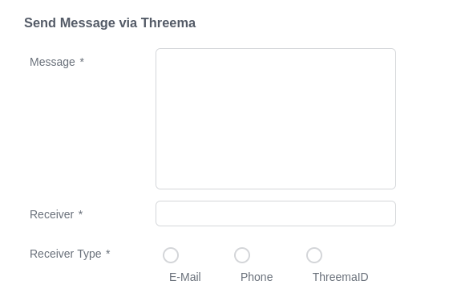
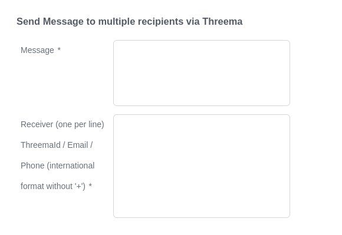
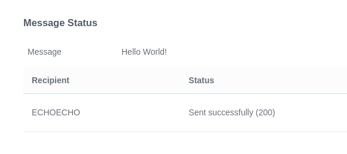

# Threema Connector
Mit dem Threema Connector von Axon Ivy können Sie durch die Integration der von
Threema bereitgestellten [Threema.Gateway API](https://threema.ch/en/gateway)
Ende-zu-Ende-verschlüsselte Nachrichten versenden. Mit diesem Connector können
Sie Nachrichten an einen oder mehrere Empfänger senden, wobei Sie die
E-Mail-Adresse, Telefonnummer oder ThreemaID als Identifikator verwenden.

Zum Versenden von Nachrichten sind Anmeldedaten und Credits erforderlich. Die
Anmeldedaten können kostenlos unter
[Threema.Gateway](https://gateway.threema.ch/en/signup) erstellt werden. Credits
können dann entsprechend der Nutzung gekauft werden. Weitere Informationen
finden Sie unter [Threema.Gateway API](https://threema.ch/en/gateway).

## Demo






## Einrichtung
1. Generieren Sie mit dem Prozess „GenerateKeyPair” ein neues Schlüsselpaar.
2. Erstellen Sie eine „End-to-End-Threema-ID” unter: [Neue ID
   anfordern](https://gateway.threema.ch/en/id-request) <br> Kostenlose Credits
   zu Testzwecken können unter
   [support-gateway@threema.ch](mailto:support-gateway@threema.ch) <br>
   angefordert werden.
3. Fügen Sie die folgenden Variablen zu Ihrem Axon Ivy-Projekt hinzu:

```
@variables.yaml@
```
